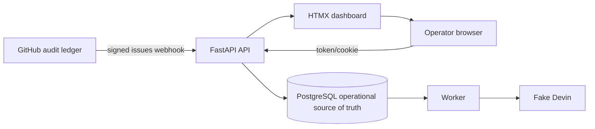
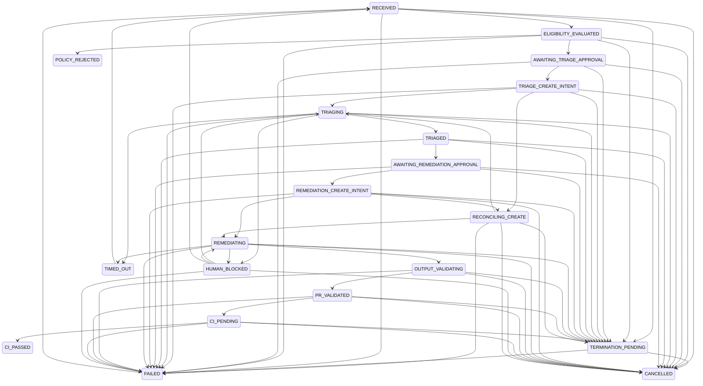

# Architecture

## Components and responsibilities

- **FastAPI API** verifies GitHub signatures, applies repository/event/action/label
  filters, persists accepted deliveries, serves health and metrics, and exposes
  authenticated operator actions.
- **Worker** claims pending webhook events or retryable `RECEIVED` cases with
  PostgreSQL row locks, runs the lifecycle processor, isolates failures per job,
  and closes resources during shutdown.
- **PostgreSQL** is the operational source of truth for webhook deliveries,
  cases, attempts, append-only transitions, and notification outbox rows.
- **Operator dashboard** is server-rendered Jinja2 with HTMX partial refreshes.
  It shows state/recommendation overviews, throughput, active work, failures,
  transitions, and case detail pages.
- **Fake Devin** is a deterministic Phase 1 client. It simulates triage and
  remediation statuses without external network calls and returns placeholder PR
  URLs for successful remediation.

GitHub remains the external **audit ledger** for issues and eventual comments,
PRs, and CI status. PostgreSQL is the local **operational source of truth** for
the orchestrator's delivery and lifecycle state.

## Lifecycle

Every state mutation goes through `transition()`, which validates the transition,
updates timestamps, sets `completed_at` for terminal states, and appends a
`StateTransition` row.

## Data model

| Table | Key columns | Purpose |
| --- | --- | --- |
| `webhook_events` | delivery ID, event/action, payload, status, claim/process timestamps, case ID | Verbatim signed deliveries and worker job state |
| `cases` | repository/issue unique key, lifecycle state, recommendation, rubric, Devin/PR/CI fields, timestamps | Current operational issue state |
| `attempts` | case, kind, Devin session, status, timing, error | Triage/remediation execution history |
| `state_transitions` | case, from/to state, reason, actor, created time | Append-only lifecycle audit trail |
| `notification_outbox` | case, channel, kind, payload, status | Phase 1 notification intents; no dispatcher runs yet |

## Webhook request path

1. Read the raw request body.
2. Verify the `X-Hub-Signature-256` HMAC before attempting JSON parsing.
3. Require delivery and event headers.
4. Parse JSON and filter repository, event type, action, and required label.
5. Return `202` for filtered requests without persisting them.
6. Insert an accepted delivery as `PENDING`, handling duplicate delivery IDs
   idempotently.
7. Commit and return `202`; processing never runs synchronously in the request.

## Worker claiming and failure isolation

The worker first selects the oldest `PENDING` webhook event using
`FOR UPDATE SKIP LOCKED`, marks it `PROCESSING`, and commits the claim. If no
event is available, it selects an old `RECEIVED` case that has no related
`PENDING` or `PROCESSING` event. The age guard prevents the retry claimant from
racing the event path. `SKIP LOCKED` lets concurrent worker loops claim separate
rows without a separate queue service.

Each job gets its own session and exception boundary. An event failure marks the
event `FAILED`, records `last_error`, and transitions its case to `FAILED` when
appropriate. A case retry failure transitions the case to `FAILED`; the loop
continues to the next job. SIGINT/SIGTERM sets the stop event, cancels loop
tasks, gathers them with `return_exceptions=True`, closes the Devin client, and
disposes the SQLAlchemy engine.

## Security boundaries

- HMAC signature verification occurs before JSON parsing.
- HMAC and operator token comparisons use constant-time `compare_digest`.
- Operator APIs accept a bearer token; browser pages use an HTTP-only
  `operator_token` cookie.
- Secrets and local `.env` files are not committed.
- Phase 1 uses only the fake Devin client; tests make no Devin/GitHub/Slack
  network calls.
- Notification outbox rows are written but never dispatched in Phase 1.
- Webhook payloads are stored verbatim for auditability; production retention
  and PII handling require an explicit policy.

## Deferred to Phase 2

- **Real Devin client:** add authenticated API calls and production polling.
- **GitHub App writes:** add issue comments, PR metadata, and status updates.
- **Slack dispatcher:** deliver pending outbox rows with retries.
- **Approval endpoints:** replace `SIMULATION_AUTO_APPROVE` with operator approval.
- **Intent reconciliation:** reconcile `CREATE_INTENT` stages and enforce
  stage deadlines leading to `TIMED_OUT`.
- **CI webhook ingestion:** advance `CI_PENDING` from GitHub status/check events.
- **Retention and cleanup:** archive or delete old payloads, attempts, and events.
