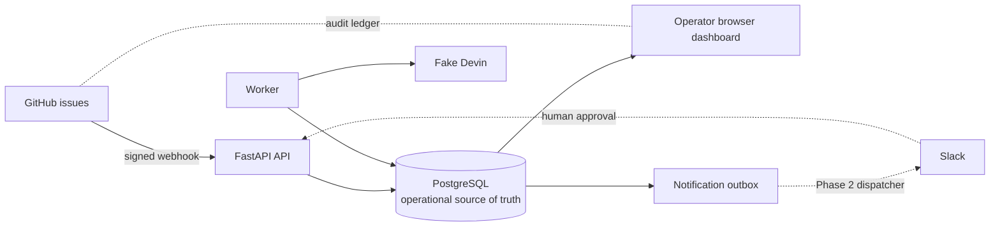
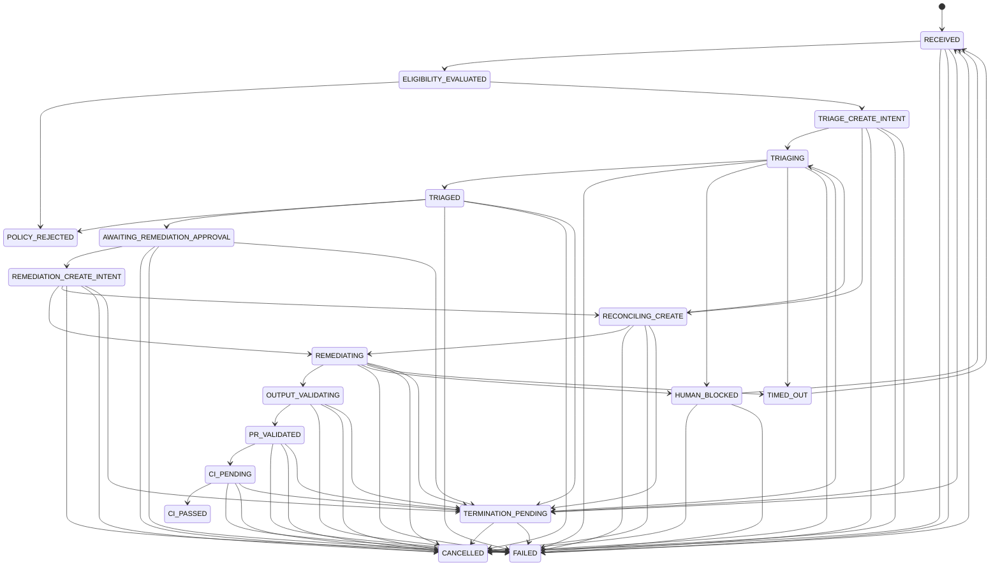

# Architecture

## Components

- **API:** FastAPI verifies signed GitHub issue deliveries, applies repository,
  event, action, and label filters, persists accepted payloads, and serves the
  authenticated operator UI.
- **Worker:** Claims pending deliveries and resumable case intents with
  PostgreSQL row locks, evaluates the zero-ACU deterministic eligibility
  filter, coordinates fake Devin sessions, and records every lifecycle change.
- **PostgreSQL:** The operational source of truth for webhook payloads, cases,
  attempts, append-only transitions, and notification outbox intents.
- **Dashboard:** Jinja2 and HTMX pages for state counts, throughput, active
  work, case history, and operator retry/cancel/approval actions.
- **Fake Devin:** A deterministic local client used in Phase 1. It never makes
  a Devin network call and simulates triage, remediation, failures, and
  blocked sessions.

GitHub remains the audit ledger for issue history and eventual comments or
pull requests. PostgreSQL is the operational source of truth for work state.

## Lifecycle

The eligibility filter runs without ACU cost. Eligible cases go directly to
triage; there is no approval or notification before triage. A feasible triage
verdict creates one Slack approval outbox intent. The Phase 2 Slack outbox
worker dispatches it, and a human approves or rejects from Slack. Phase 1
provides operator endpoints as the stand-in; both paths call the same approval
service.

`TRIAGE_CREATE_INTENT` and `REMEDIATION_CREATE_INTENT` make external session
creation resumable. Triage infeasibility transitions to `POLICY_REJECTED`,
records a GitHub notification intent, and creates no remediation attempt.
Retries from `FAILED` or `TIMED_OUT` normally return to eligibility, while a
case whose latest attempt is a failed remediation after successful triage
returns directly to `REMEDIATION_CREATE_INTENT`.

## Data model

| Table | Key columns | Purpose |
| --- | --- | --- |
| `webhook_events` | delivery id, payload, status, case id | Verbatim accepted webhook deliveries and processing lease |
| `cases` | issue identity, state, recommendation, Devin/PR fields | Current operational case record |
| `attempts` | case, kind, Devin session, status | Triage and remediation session audit |
| `state_transitions` | case, from/to state, reason, actor | Append-only lifecycle audit |
| `notification_outbox` | case, channel, kind, payload, status | Notification intents; not dispatched in Phase 1 |

## Webhook request path

1. Read the raw request body.
2. Verify `X-Hub-Signature-256` with HMAC-SHA256 before parsing JSON.
3. Require the delivery and event headers, parse JSON, and apply repository,
   event, action, and required-label filters.
4. Persist accepted payloads as `PENDING` using the unique delivery id.
5. Return `202`; duplicate deliveries are acknowledged as deduplicated.

Filtered requests are acknowledged but never persisted, and the API performs no
worker processing inline.

## Worker claiming and failure isolation

The worker first claims one `PENDING` webhook event, or reclaims a
`PROCESSING` event whose lease expired. It then claims cases in
`RECEIVED`, `TRIAGE_CREATE_INTENT`, `REMEDIATION_CREATE_INTENT`, or
`TERMINATION_PENDING` when their case lease is free or expired and no related
event is pending (or processing with an unexpired lease). Each claim uses
`SELECT ... FOR UPDATE SKIP LOCKED`, records a worker id and lease, and
commits before processing. This provides queue-like concurrency without
introducing Redis or another queue service.

State writes are guarded by `UPDATE ... WHERE state = expected_state` and the
current worker owner; a concurrent operator or worker therefore cannot
overwrite a newer state or a stolen lease. A heartbeat renews each case and
event lease at roughly one third of the lease duration.
Devin
CREATE_INTENT attempts have durable idempotency keys and are reconciled after
a crash, with a bounded second lookup before declaring reconciliation failure.
If a create returns after ownership was lost, the session is terminated and
the attempt is recorded as orphaned. A lease is released after success,
failure, or a concurrent-change abandonment. If a process stops, in-flight
jobs are drained for up to the configured shutdown timeout; anything longer is
reclaimed after lease expiry. Docker's worker stop grace period exceeds that
timeout.

Webhook and case processing are isolated in their own transactions. Exceptions
mark the event or case failed and are logged; the loop continues to process
other work. Invalid concurrent transitions are logged at INFO and do not fail
the case. On SIGTERM or SIGINT, loops stop after their current job, in-flight
tasks are drained up to the configured timeout, then cancelled if necessary;
the Devin client closes and the database engine is disposed.

## Security boundaries

- Signature verification occurs before JSON parsing.
- HMAC signatures and operator tokens use constant-time comparisons.
- Operator pages require a bearer token or signed-in cookie; API-like requests
  receive `401`, while browser pages redirect to `/login`.
- Secrets are environment values and are not committed to the repository.
- Phase 1 uses only the fake Devin client.
- Outbox rows are recorded but not dispatched in Phase 1.
- Accepted webhook payloads are stored verbatim; deployments should consider
  retention and possible personal information in issue bodies.

## Deferred to Phase 2

- **Real Devin client:** replace the deterministic fake with authenticated API calls.
- **GitHub App writes:** publish comments, branches, pull requests, and statuses.
- **Slack dispatcher:** dispatch pending outbox rows and retry delivery.
- **Slack approval interactivity:** call the existing approval service from Slack.
- **Stage deadline reconciliation:** apply longer-lived stage deadlines and operational escalation to `TIMED_OUT`.
- **CI webhook ingestion:** advance `CI_PENDING` from GitHub CI events.
- **Retention and cleanup:** expire old payloads, attempts, and notification records.
