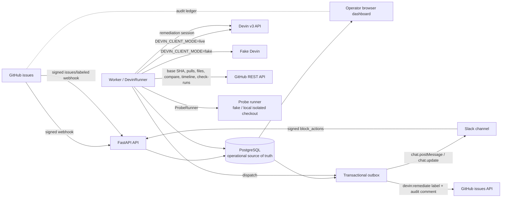

# Architecture

## Components

- **API:** FastAPI verifies signed GitHub issue deliveries, applies repository,
  event, action, and label filters, persists accepted payloads, and serves the
  authenticated operator UI.
- **Worker:** Claims pending deliveries and resumable case intents with
  PostgreSQL row locks, evaluates the zero-ACU deterministic eligibility
  filter, coordinates fake Devin sessions, and records every lifecycle change.
- **PostgreSQL:** The operational source of truth for webhook payloads, cases,
  attempts, append-only transitions, approval requests/events, Slack action
  dedupe records, and the transactional notification outbox.
- **Dashboard:** Jinja2 and HTMX pages for state counts, throughput, active
  work, case history, approval/delivery status, outbox attempts and errors,
  and operator retry/cancel/outbox-retry/token-expire actions. There is no
  dashboard approve/reject: the only decision surface is Slack.
- **Devin client (`remediator/devin`):** One `DevinClient` protocol with two
  implementations selected by `DEVIN_CLIENT_MODE`. `LiveDevinClient` calls the
  official Devin v3 API (`POST/GET/DELETE /v3/organizations/{org_id}/sessions…`)
  over httpx; `FakeDevinClient` emits API-shaped snapshots (same `status` /
  `status_detail` vocabulary) per deterministic scenario and never touches the
  network. Both share `status.classify`, the Draft 7 triage output schema, the
  versioned prompt template, and the tag helpers.
- **DevinRunner (`remediator/worker/devin_runner.py`):** The bounded session
  state machine: durable create intent → single create → reconcile-by-tag →
  poll until deadline → final GET → remote termination → schema validation.
  Phase-aware: triage attempts use the generic states, remediation attempts
  use the `REMEDIATION_*` variants, so one audit trail never mixes phases.
- **RemediationPipeline (`remediator/worker/remediation.py`):** Consumes
  `REMEDIATION_APPROVED`: zero-ACU preconditions → probe snapshot → probe at
  base → DevinRunner → structured-output validation → PR discovery from
  `pull_requests[]` → GitHub PR validation → probe at head → bounded CI
  polling. Each stage is a separate resumable case state.
- **Probe registry and runners (`remediator/probes`):** Loads and validates
  `probes/<owner>/<repo>/<issue>/probe.yaml` + `probe.sh` (schema, repository,
  issue, 40-hex base SHA, exit codes, timeout, runtime tools, script SHA-256
  recomputed and compared), records the registry commit, and exposes a
  `ProbeRunner` protocol. `FakeProbeRunner` is deterministic by issue number;
  `RemoteProbeRunner` forwards the spec to the verifier container after
  checking its `/health` (no credentials visible, non-root, read-only root).
- **Verifier service (`remediator/verifier`, `docker/verifier/Dockerfile`):**
  the only process that executes repository code. Separate container with no
  secrets, no import of `remediator.config`, dedicated UID, read-only root,
  bounded tmpfs, dropped capabilities, PID/memory limits and its own network.
  `LocalProbeRunner` lives here: exact-commit clone into a temp workspace,
  snapshotted script with fixed argv and minimal environment, deadline covering
  process exit, rlimits, marker-based descendant kill, workspace cleanup.
- **Slack adapter (`remediator/slack`):** request signature verification
  (`v0:{ts}:{raw body}` HMAC-SHA256, replay window, constant-time compare),
  a Block Kit builder that escapes untrusted text and enforces Slack limits,
  and `SlackClient` implementations: `FakeSlackClient` persists messages in
  `slack_fake_messages`; `LiveSlackClient` calls `chat.postMessage` /
  `chat.update`.
- **GitHub client (`remediator/github/client.py`):** `FakeGitHubClient` and
  `LiveGitHubClient` (issues GET, labels POST, comments POST, plus typed pulls,
  PR files, compare, issue timeline cross-references and commit check runs).
  Every call checks the repository allowlist before any network I/O; the fake
  derives PR/CI shape from the fixture issue number.
- **Approval service (`remediator/approvals.py`):** creates approval requests
  after a valid `remediation_candidate` triage, processes verified Slack
  actions (token → expiry → approver → state → dedupe) in one transaction,
  and confirms delivery from the signed `issues/labeled` webhook.
- **Outbox dispatcher (`remediator/worker/outbox.py`):** claims outbox rows
  with leases, performs the Slack/GitHub call, applies bounded exponential
  backoff, and marks terminal failures visibly.



Slack has no path to Devin: the API records the decision, the worker talks
only to GitHub, and the case advances only on GitHub's own webhook.

GitHub remains the audit ledger for issue history and eventual comments or
pull requests. PostgreSQL is the operational source of truth for work state.

## Phase 2 triage flow

```text
GitHub issue opened
→ deterministic zero-ACU eligibility filter        (rubric.py, no Devin call)
→ eligible issue automatically queues Devin triage (TRIAGE_CREATE_INTENT)
→ durable create intent                            (attempts row + unique operation_key, committed BEFORE POST)
→ bounded Devin session                            (max_acu_limit, absolute timeout_at, exact op tag)
→ schema-validated triage result                   (structured_output_required + Draft 7 validation)
→ awaiting remediation approval                    (AWAITING_REMEDIATION_APPROVAL)
```

## Phase 3 approval flow

```text
validated remediation_candidate                    (worker _finish_triage)
→ approval_requests row + slack outbox row         (same transaction as the triage result)
→ worker posts Block Kit message                   (fake or live; failure never touches the triage result)
   token generated, sha256 + SENDING committed BEFORE chat.postMessage; message carries
   request metadata; retry reconciles by metadata before reposting; then SENT + channel/ts
→ POST /webhooks/slack/actions                     (raw body → timestamp window → HMAC → parse)
   approve: decision recorded (actor, time, action id, triage hash, label op)
            + outbox apply_remediation_label + slack update
   reject:  REMEDIATION_REJECTED + outbox rejection_comment + slack update
→ worker apply_remediation_label                   (issue exists? allowlisted? request current? attempt current?
                                                    label_requested_at committed → add label → LABEL_APPLIED
                                                    comment_requested_at committed → marker search → comment once)
→ GitHub issues/labeled webhook (signed)           → REMEDIATION_APPROVED (only when our delivery is LABEL_APPLIED)
```

Design points:

- **Only candidates notify.** `approval_requests` is created only when the
  triage output validated against the schema and `outcome ==
  remediation_candidate`; a unique constraint on `attempt_id` prevents a
  second notification for the same triage result.
- **Opaque tokens.** The button value is `secrets.token_urlsafe(32)`; only its
  SHA-256 and expiry are stored. Repository, issue number, and case id are
  resolved from the token row, never from the Slack payload. On approval,
  rejection or expiry the stored hash is rotated to
  `sha256("retired:" + hash)`, so the live token no longer resolves to a
  decidable row while a repeat click can still be answered with the current
  state.
- **One current round per case.** A re-triage (operator retry after `FAILED`)
  creates a new `approval_requests` row and, in the same transaction, marks
  every earlier `PENDING` row `SUPERSEDED`, nulls its token hash, and queues a
  Slack update that removes its buttons. Slack actions, the label outbox job
  and the label webhook all require the request to be the case's newest round
  *and* bound to the case's newest triage attempt (`is_current_request`);
  anything else is `stale_token` / a permanent outbox failure and never
  labels.
- **Dedupe.** `slack_actions` has a unique `(approval_request_id, action_ts,
  slack_user_id)` key; a repeated click returns `duplicate` and the current
  state. A click after a decision returns `already_decided`.
- **Exactly-once external writes.** Every non-idempotent outbound call is
  bracketed by a committed intent marker: `notification_status=SENDING` +
  token hash before `chat.postMessage` (messages carry
  `metadata.event_type=remediator_approval_request` and are looked up through
  `conversations.history` before a repost — the live bot needs
  `channels:history`/`groups:history`; if that lookup fails non-retryably, e.g.
  `missing_scope`, the row fails with the reason and nothing is reposted),
  `label_requested_at` before `POST .../labels` (the issue's labels
  are re-read before a retry), and `comment_requested_at` before
  `POST .../comments` (comments end with `<!-- remediator:approval:<id> -->`
  / `<!-- remediator:rejection:<id> -->` and are searched before a retry). A
  crash between the provider accepting the write and our commit therefore
  never produces a second message, label or comment.
- **Fast acknowledgement.** The Slack endpoint does one short transaction and
  returns; Slack HTTP (message updates) and GitHub HTTP run in the worker.
- **GitHub is the authority.** After the worker applies the label the
  approval request shows `LABEL_APPLIED`, but the case stays in
  `AWAITING_REMEDIATION_APPROVAL` (or `APPROVAL_DELIVERY_FAILED` after a retry)
  until the signed `issues/labeled` webhook for `GITHUB_REMEDIATION_LABEL`
  arrives; then `confirm_label_webhook` moves it to `REMEDIATION_APPROVED`.
  Confirmation additionally requires that *our* delivery has recorded
  `LABEL_APPLIED` for the current request and attempt: a `labeled` webhook
  that arrives before the worker applied the label (someone else added it, or
  the delivery is still pending/failed) is audited as
  `label_webhook_unexpected`, leaves the case unchanged, and does not cancel
  the outbox job, which still reconciles the label and posts the audit
  comment. GitHub emits the webhook as soon as our label POST lands, which can
  be before the worker commits `label_applied_at`; GitHub never resends it, so
  right after that commit the worker replays any already-processed `labeled`
  delivery for the issue that was processed after `label_requested_at`
  (`label_webhook_replayed` + `label_confirmed`), and the case reaches
  `REMEDIATION_APPROVED` without waiting for a webhook that will not come.
  Deliveries processed before our intent existed are not replayed. A `labeled`
  webhook for a case without a recorded `APPROVED` decision is treated as an
  ordinary ingest and does not advance the case.
- **Failure isolation.** Slack post failures leave the triage result and
  case untouched; after `OUTBOX_MAX_ATTEMPTS` the row is `FAILED` with
  `last_error`. GitHub label failures keep the approval decision and move the
  case to `APPROVAL_DELIVERY_FAILED`; `POST /operator/outbox/{id}/retry`
  re-queues the same row (409 unless it is `FAILED`) and never requires a
  second human decision. If the label landed but only the audit comment
  failed, delivery stays `LABEL_APPLIED` and `approval_comment_failed` is
  recorded instead. Backoff is exponential with jitter, but a provider
  `Retry-After` / `X-RateLimit-Reset` hint (Slack 429, GitHub 403/429 rate
  limits, which are classified retryable) is honoured up to
  `OUTBOX_MAX_BACKOFF_SECONDS`. Phase 1/2 record-only outbox kinds
  (`eligibility_rejected`, `case_completed`, `case_failed`, `human_blocked`)
  are audit rows and complete as `SENT` without any external call.
- **Nothing calls Devin.** No Phase 3 code path creates a `REMEDIATION`
  attempt or reaches `REMEDIATION_CREATE_INTENT`; the integration tests assert
  the fake Devin create count is unchanged across approval.

### Create intent and spend-boundary idempotency

The Devin create endpoint has no idempotency key, so the runner makes the
boundary durable on our side:

1. Insert the `attempts` row with `operation_key = op:<case>:<kind>:<n>`
   (`UNIQUE`) and `create_state = PENDING`; a partial unique index also
   enforces one unfinished attempt per `(case, kind)`. Commit.
2. Validate the request (allowlisted repository, resolvable base SHA, prompt
   renders). Any failure → `create_state = NOT_SENT`, attempt `FAILED`, no HTTP.
3. `POST /sessions` exactly once with the operation key as the first tag plus
   correlation tags (`repo:`, `issue:`, `kind:`, `case:`, `attempt:`).
   - Definitive 4xx/5xx → `API_ERROR`, attempt `FAILED`, case `FAILED`.
   - Transport failure/timeout → `UNCERTAIN`, case `RECONCILING_CREATE`.
4. Reconcile by listing sessions and matching the exact operation tag
   client-side (bounded lookups with backoff). Exactly one match →
   `RECONCILED` and polling continues on that session. No match after the
   bounded lookups, or more than one → `UNRESOLVED`, case `HUMAN_BLOCKED`.
   A second POST is never issued automatically.

### Polling and status mapping (`remediator/devin/status.py`)

| Remote `status` | `status_detail` | Disposition |
| --- | --- | --- |
| `new`, `claimed`, `running`, `resuming` | working / other | keep polling |
| any live status | `finished` | validate structured output |
| any live status | `waiting_for_user`, `waiting_for_approval` | `HUMAN_BLOCKED`, session URL retained, no replacement |
| `exit` | `finished` | validate structured output |
| `exit`, `error` | anything else | attempt `FAILED` |
| `suspended` | usage/credit/quota/billing/limit | attempt `FAILED` (terminal) |
| `suspended` | other (inactivity, user request) | `HUMAN_BLOCKED` |
| unknown | unknown | attempt `RECONCILING`, keep polling until deadline |

Session completion alone is never success: the `structured_output` must exist
and validate against `TRIAGE_OUTPUT_SCHEMA`, and `outcome` must be one of
`remediation_candidate`, `needs_human`, `no_change_needed`,
`deterministic_automation`, `invalid_issue`. Only `remediation_candidate`
advances to `AWAITING_REMEDIATION_APPROVAL`; every other outcome ends at
`POLICY_REJECTED` with a `triage_not_feasible` GitHub outbox intent carrying
the summary and blocking questions.

### Timeout and termination

When `now >= attempt.timeout_at` the runner performs one final `GET`. If the
session finished in the polling gap it is processed normally (no false
timeout). Otherwise it calls `DELETE /sessions/{id}`. Success → attempt and
case `TIMED_OUT`. Failure → case `TERMINATION_PENDING`; the worker reclaims it
after lease expiry and retries the final-GET/DELETE cycle until termination is
confirmed. Local polling therefore never stops while a paid session may still
be running unobserved.

The same final-GET/DELETE path handles every other way a live session can
lose its local owner:

- **Worker error.** An unexpected exception while an attempt has a sent
  create (`create_sent_at` set) parks the attempt and case in
  `TERMINATION_PENDING` with a `worker error: …` reason instead of `FAILED`;
  `fail_case` refuses to make such a case terminal until the remote session is
  confirmed gone. Lease loss / concurrent transitions cancel only attempts
  whose create was never sent.
- **Operator cancel.** Cancelling a case in `TRIAGING`, `REMEDIATING`, or any
  state whose active/blocked attempt may own a session moves it to
  `TERMINATION_PENDING`. The poll loop re-reads the case state every
  iteration, so a cancel during polling terminates the session on the next
  poll rather than at the deadline. A `PENDING` create is terminated by exact
  tag lookup.
- **Retry.** Before a new create, earlier blocked attempts with a known
  session id are `DELETE`d (failure blocks the retry). An `UNRESOLVED` create
  never permits a second `POST` until the operator retries with
  `confirm_no_session=true`, which records the acknowledgement on the attempt.

The deadline `timeout_at` is anchored when the session is attached (after the
`POST` returns or the tag reconciliation succeeds), not before create latency.

### Restart recovery

All runner state lives in the `attempts` row (session id, deadline, poll
counters, create state). The worker claims cases in `TRIAGE_CREATE_INTENT`,
`TRIAGING`, `RECONCILING_CREATE`, and `TERMINATION_PENDING` whose lease has
expired and resumes from the persisted attempt: a `PENDING` create is
reconciled by tag rather than re-sent, a `CREATED` session is polled, a
pending termination is retried.

## Phase 4 remediation flow

```text
REMEDIATION_APPROVED
  │ zero-ACU preconditions: allowlist, approval.decision=APPROVED and
  │ approval.triage_result_hash == sha256(current validated triage), triage
  │ attempt is the latest (not superseded), default branch configured,
  │ `devin:remediate` present on the exact open issue (GitHub GET), no active
  │ REMEDIATION attempt, no PullRequestEvidence.valid=true, approved probe
  │ loads and validates → ProbeSnapshot row (manifest, script content, hashes,
  │ registry commit, expected exit codes, timeout, runtime)
  ▼
PROBE_VALIDATING_BASE          probe @ manifest.base_sha, persisted ProbeExecution
  ├─ exit == expected_base  → REMEDIATION_CREATE_INTENT (spend permitted)
  ├─ exit == expected_head  → REMEDIATION_HUMAN_BLOCKED  no_change_needed, 0 ACU
  ├─ infrastructure         → PROBE_INFRASTRUCTURE_BLOCKED             0 ACU
  └─ other / timeout        → REMEDIATION_FAILED                       0 ACU
REMEDIATION_CREATE_INTENT      attempt + operation key op:<case>:REMEDIATION:<hash12>:<sha12>:<n>
  │                            (UNIQUE, exact session tag); BASE execution re-linked to attempt
  ├─ POST ok                → REMEDIATING
  ├─ POST uncertain         → REMEDIATION_RECONCILING_CREATE (list by tag; never re-POST)
  │                              ├─ one match → REMEDIATING
  │                              └─ inconclusive → REMEDIATION_HUMAN_BLOCKED
  └─ definitive API error   → REMEDIATION_FAILED
REMEDIATING                    poll; deadline → final GET → DELETE → REMEDIATION_TERMINATION_PENDING
  ├─ finished               → OUTPUT_VALIDATING
  ├─ waiting_for_user etc.  → REMEDIATION_HUMAN_BLOCKED (session retained)
  └─ termination confirmed  → REMEDIATION_TIMED_OUT
OUTPUT_VALIDATING              remediation.v1 schema; outcome routing:
  ├─ pr_created             → PR_DISCOVERED (candidate from pull_requests[] only)
  ├─ no_change_needed       → REMEDIATION_HUMAN_BLOCKED (base evidence disagreed)
  ├─ needs_human            → REMEDIATION_HUMAN_BLOCKED (blocking_questions shown)
  └─ failed / invalid       → REMEDIATION_FAILED
PR_DISCOVERED → PR_VALIDATING  GitHub GET pull, files, compare, timeline
  │ exists in allowlisted repo, open/draft & not merged, base == default branch,
  │ head ref starts with prefix, head SHA == structured output, ahead of pinned
  │ base (compare status ahead/diverged handled), closing ref resolves to this
  │ issue (timeline cross-reference, then exact owner/repo#N), author in
  │ GITHUB_PR_AUTHOR_LOGINS, no forbidden paths (probes/, .github/, repo
  │ settings), changed_files declared, count <= REMEDIATION_MAX_CHANGED_FILES
  ├─ all pass               → PROBE_VALIDATING_HEAD
  ├─ scope expansion        → REMEDIATION_HUMAN_BLOCKED
  └─ any contradiction      → REMEDIATION_FAILED (PullRequestEvidence.valid=false)
PROBE_VALIDATING_HEAD          identical snapshot/hash @ head_sha
  ├─ exit == expected_head  → PR_VALIDATED → CI_PENDING
  ├─ infrastructure         → REMEDIATION_FAILED (class=infrastructure; retry-probe allowed)
  └─ mismatch               → REMEDIATION_FAILED (no automatic fix chain)
CI_PENDING                     check runs for head_sha, bounded by CI_TIMEOUT_SECONDS
  ├─ required all success  → CI_PASSED   (ready for human review; no merge)
  ├─ failure/cancelled/timed_out/absent at deadline → CI_FAILED (retry-ci allowed)
  └─ pending               → stay, ci_snapshots row per poll
```

Every milestone enqueues a `remediation_status_update` outbox row that edits
the original Slack approval message; Slack failures are retried by the outbox
and never touch remediation state.

## Lifecycle

The eligibility filter runs without ACU cost. Eligible cases go directly to
triage; there is no approval or notification before triage. A
`remediation_candidate` verdict creates one approval request and one Slack
outbox row; an authorized human approves or rejects from Slack, and the case
reaches `REMEDIATION_APPROVED` only through GitHub's signed `labeled` webhook.
From there the remediation pipeline above takes over; remediation-phase
terminations always use the `REMEDIATION_*` variants.

```mermaid
stateDiagram-v2
  [*] --> RECEIVED
  RECEIVED --> ELIGIBILITY_EVALUATED
  ELIGIBILITY_EVALUATED --> POLICY_REJECTED
  ELIGIBILITY_EVALUATED --> TRIAGE_CREATE_INTENT
  TRIAGE_CREATE_INTENT --> TRIAGING
  TRIAGE_CREATE_INTENT --> RECONCILING_CREATE
  TRIAGE_CREATE_INTENT --> FAILED
  TRIAGE_CREATE_INTENT --> CANCELLED
  TRIAGE_CREATE_INTENT --> TERMINATION_PENDING
  TRIAGING --> TRIAGED
  TRIAGING --> FAILED
  TRIAGING --> HUMAN_BLOCKED
  TRIAGING --> TIMED_OUT
  TRIAGED --> POLICY_REJECTED
  TRIAGED --> AWAITING_REMEDIATION_APPROVAL
  TRIAGED --> FAILED
  TRIAGED --> CANCELLED
  TRIAGED --> TERMINATION_PENDING
  AWAITING_REMEDIATION_APPROVAL --> REMEDIATION_APPROVED: signed labeled webhook
  AWAITING_REMEDIATION_APPROVAL --> REMEDIATION_REJECTED: Slack reject
  AWAITING_REMEDIATION_APPROVAL --> APPROVAL_DELIVERY_FAILED: label outbox exhausted
  AWAITING_REMEDIATION_APPROVAL --> CANCELLED
  AWAITING_REMEDIATION_APPROVAL --> FAILED
  APPROVAL_DELIVERY_FAILED --> REMEDIATION_APPROVED: retry + signed labeled webhook
  APPROVAL_DELIVERY_FAILED --> CANCELLED
  APPROVAL_DELIVERY_FAILED --> FAILED
  APPROVAL_DELIVERY_FAILED --> TERMINATION_PENDING
  REMEDIATION_REJECTED --> [*]
  REMEDIATION_APPROVED --> PROBE_VALIDATING_BASE: preconditions + snapshot
  REMEDIATION_APPROVED --> REMEDIATION_HUMAN_BLOCKED
  REMEDIATION_APPROVED --> REMEDIATION_FAILED
  REMEDIATION_APPROVED --> REMEDIATION_CANCELLED
  PROBE_VALIDATING_BASE --> REMEDIATION_CREATE_INTENT: base fails as declared
  PROBE_VALIDATING_BASE --> REMEDIATION_HUMAN_BLOCKED: no_change_needed
  PROBE_VALIDATING_BASE --> PROBE_INFRASTRUCTURE_BLOCKED
  PROBE_VALIDATING_BASE --> REMEDIATION_FAILED
  PROBE_VALIDATING_BASE --> REMEDIATION_CANCELLED
  PROBE_INFRASTRUCTURE_BLOCKED --> PROBE_VALIDATING_BASE: operator retry-probe
  PROBE_INFRASTRUCTURE_BLOCKED --> REMEDIATION_CANCELLED
  REMEDIATION_CREATE_INTENT --> REMEDIATING
  REMEDIATION_CREATE_INTENT --> REMEDIATION_RECONCILING_CREATE
  REMEDIATION_CREATE_INTENT --> REMEDIATION_TERMINATION_PENDING
  REMEDIATION_CREATE_INTENT --> REMEDIATION_FAILED
  REMEDIATION_CREATE_INTENT --> REMEDIATION_CANCELLED
  REMEDIATION_RECONCILING_CREATE --> REMEDIATING: single tag match
  REMEDIATION_RECONCILING_CREATE --> REMEDIATION_HUMAN_BLOCKED: inconclusive
  REMEDIATION_RECONCILING_CREATE --> REMEDIATION_TERMINATION_PENDING
  REMEDIATION_RECONCILING_CREATE --> REMEDIATION_FAILED
  REMEDIATION_RECONCILING_CREATE --> REMEDIATION_CANCELLED
  REMEDIATING --> OUTPUT_VALIDATING
  REMEDIATING --> REMEDIATION_HUMAN_BLOCKED
  REMEDIATING --> REMEDIATION_TIMED_OUT
  REMEDIATING --> REMEDIATION_TERMINATION_PENDING
  REMEDIATING --> REMEDIATION_FAILED
  REMEDIATING --> REMEDIATION_CANCELLED
  OUTPUT_VALIDATING --> PR_DISCOVERED
  OUTPUT_VALIDATING --> REMEDIATION_HUMAN_BLOCKED
  OUTPUT_VALIDATING --> REMEDIATION_FAILED
  OUTPUT_VALIDATING --> REMEDIATION_CANCELLED
  PR_DISCOVERED --> PR_VALIDATING
  PR_DISCOVERED --> REMEDIATION_HUMAN_BLOCKED
  PR_DISCOVERED --> REMEDIATION_FAILED
  PR_DISCOVERED --> REMEDIATION_CANCELLED
  PR_VALIDATING --> PROBE_VALIDATING_HEAD
  PR_VALIDATING --> REMEDIATION_HUMAN_BLOCKED: scope expansion
  PR_VALIDATING --> REMEDIATION_FAILED: contradiction
  PR_VALIDATING --> REMEDIATION_CANCELLED
  PROBE_VALIDATING_HEAD --> PR_VALIDATED
  PROBE_VALIDATING_HEAD --> REMEDIATION_HUMAN_BLOCKED
  PROBE_VALIDATING_HEAD --> REMEDIATION_FAILED
  PROBE_VALIDATING_HEAD --> REMEDIATION_CANCELLED
  PR_VALIDATED --> CI_PENDING
  PR_VALIDATED --> REMEDIATION_FAILED
  PR_VALIDATED --> REMEDIATION_CANCELLED
  CI_PENDING --> CI_PASSED
  CI_PENDING --> CI_FAILED
  CI_PENDING --> REMEDIATION_HUMAN_BLOCKED
  CI_PENDING --> REMEDIATION_FAILED
  CI_PENDING --> REMEDIATION_CANCELLED
  CI_PASSED --> [*]
  CI_FAILED --> CI_PENDING: operator retry-ci
  CI_FAILED --> REMEDIATION_CANCELLED
  REMEDIATION_HUMAN_BLOCKED --> REMEDIATION_APPROVED: operator retry (new attempt)
  REMEDIATION_HUMAN_BLOCKED --> REMEDIATION_TERMINATION_PENDING
  REMEDIATION_HUMAN_BLOCKED --> REMEDIATION_FAILED
  REMEDIATION_HUMAN_BLOCKED --> REMEDIATION_CANCELLED
  REMEDIATION_TERMINATION_PENDING --> REMEDIATION_TIMED_OUT: DELETE confirmed
  REMEDIATION_TERMINATION_PENDING --> OUTPUT_VALIDATING: final GET saw completion
  REMEDIATION_TERMINATION_PENDING --> REMEDIATION_HUMAN_BLOCKED
  REMEDIATION_TERMINATION_PENDING --> REMEDIATION_FAILED
  REMEDIATION_TERMINATION_PENDING --> REMEDIATION_CANCELLED
  REMEDIATION_FAILED --> REMEDIATION_APPROVED: operator retry (new attempt)
  REMEDIATION_FAILED --> PROBE_VALIDATING_HEAD: retry-probe (infrastructure only)
  REMEDIATION_FAILED --> CI_PENDING: retry-ci
  REMEDIATION_FAILED --> REMEDIATION_CANCELLED
  REMEDIATION_TIMED_OUT --> REMEDIATION_APPROVED: operator retry (new attempt)
  REMEDIATION_TIMED_OUT --> REMEDIATION_CANCELLED
  REMEDIATION_CANCELLED --> [*]
  HUMAN_BLOCKED --> RECEIVED
  HUMAN_BLOCKED --> CANCELLED
  HUMAN_BLOCKED --> FAILED
  HUMAN_BLOCKED --> TERMINATION_PENDING
  FAILED --> RECEIVED
  TIMED_OUT --> RECEIVED
  TERMINATION_PENDING --> CANCELLED
  TERMINATION_PENDING --> FAILED
  RECEIVED --> CANCELLED
  RECEIVED --> FAILED
  RECEIVED --> TERMINATION_PENDING
  TRIAGING --> CANCELLED
  TRIAGING --> TERMINATION_PENDING
  REMEDIATING --> CANCELLED
  REMEDIATING --> TERMINATION_PENDING
  AWAITING_REMEDIATION_APPROVAL --> TERMINATION_PENDING
  RECONCILING_CREATE --> TRIAGING
  RECONCILING_CREATE --> HUMAN_BLOCKED
  RECONCILING_CREATE --> FAILED
  RECONCILING_CREATE --> CANCELLED
  RECONCILING_CREATE --> TERMINATION_PENDING
  TERMINATION_PENDING --> TIMED_OUT
  TERMINATION_PENDING --> TRIAGED
  TERMINATION_PENDING --> HUMAN_BLOCKED
```



`TRIAGE_CREATE_INTENT` and `REMEDIATION_CREATE_INTENT` make external session
creation resumable. Triage infeasibility transitions to `POLICY_REJECTED`,
records a GitHub notification intent, and creates no remediation attempt.
Retries from `FAILED` or `TIMED_OUT` return to eligibility. Remediation
retries (`REMEDIATION_FAILED`, `REMEDIATION_TIMED_OUT`,
`REMEDIATION_HUMAN_BLOCKED`) return to `REMEDIATION_APPROVED` so the
preconditions and the base probe run again and a new attempt/operation key is
minted; `PROBE_VALIDATING_HEAD` and `CI_PENDING` are re-enterable only for
infrastructure failures on the already-verified attempt. Every remediation
attempt records `failure_stage` (`dispatch`, `probe_base`, `create`, `session`,
`output`, `pr`, `probe_head`, `ci`) and `failure_class` (`policy`,
`session`, `verification`, `infrastructure`) so operator retries can be
authorised precisely.

## Data model

| Table | Key columns | Purpose |
| --- | --- | --- |
| `webhook_events` | delivery id, payload, status, case id | Verbatim accepted webhook deliveries and processing lease |
| `cases` | issue identity, state, recommendation, Devin/PR fields | Current operational case record |
| `attempts` | case, kind, `operation_key` (unique), `create_state`, Devin session id/url/tags/status/detail, ACU telemetry, `base_sha`, `prompt_version`, poll timestamps, `timeout_at`, validated `structured_output`, `reconciliation_reason` | Durable create intent and bounded session audit; partial unique index = one unfinished attempt per (case, kind) |
| `state_transitions` | case, from/to state, reason, actor | Append-only lifecycle audit |
| `notification_outbox` | case, channel, kind, payload, status, `attempts_count`, `next_attempt_at`, `last_error`, lease, `dedupe_key`, `terminal_failure` | Transactional outbox dispatched by the worker with bounded backoff |
| `approval_requests` | case (unique), triage attempt, `triage_result_hash`, `action_token_hash` + expiry, Slack channel/ts, notification status, decision/actor/time/action id/reason, label operation, delivery status, GitHub comment id | One approval per case; authoritative record of the human decision |
| `slack_actions` | approval request, `action_ts`, Slack user, action id, outcome | Unique dedupe key and append-only audit of every verified click |
| `approval_events` | approval request, kind, actor, detail | Append-only approval timeline shown in the dashboard |
| `slack_fake_messages` | channel, ts, text, blocks | Fake adapter store, readable only via the authenticated operator API |
| `probe_snapshots` | case, repository, issue, `probe_identifier`, `base_sha`, manifest (JSON) + `manifest_hash`, `script_content` + `script_hash`, `registry_commit`, expected exit codes, timeout, runtime | Immutable copy of the approved probe taken at dispatch; every execution references it, never the working tree |
| `probe_executions` | snapshot, attempt (nullable for the pre-session BASE run), target `BASE`/`HEAD`, `commit_sha`, `runner_mode`, `command_identity`, `script_hash`, exit code, expected code, `verdict` (`MATCHED`/`MISMATCHED`/`INFRASTRUCTURE`), duration, bounded stdout/stderr, `timed_out`, `output_truncated` | Independent reproduction evidence |
| `pull_request_evidence` | case, attempt, repository, PR number/url, base/head ref and SHA, author, state, merged, changed files, `checks` (JSON of every validation), `valid` | GitHub-side corroboration of the Devin-reported PR |
| `ci_snapshots` | attempt, `head_sha`, `overall`, `checks` (name/status/conclusion/url), required/missing names, polled_at | One row per CI poll; `cases.ci_status` mirrors the latest |
| `attempts` (Phase 4 columns) | `triage_result_hash`, `probe_snapshot_id`, `devin_pull_requests`, `pr_url`, `pr_number`, `branch`, `head_sha`, `ci_deadline_at`, `failure_stage`, `failure_class` | Ties the remediation attempt to the approved triage result, probe, PR and CI |

## Webhook request path

1. Read the raw request body.
2. Verify `X-Hub-Signature-256` with HMAC-SHA256 before parsing JSON.
3. Require the delivery and event headers, parse JSON, and apply repository,
   event, action, and required-label filters.
4. Persist accepted payloads as `PENDING` using the unique delivery id.
5. Return `202`; duplicate deliveries are acknowledged as deduplicated.

Filtered requests are acknowledged but never persisted, and the API performs no
worker processing inline.

`issues/labeled` deliveries are additionally routed to
`approvals.confirm_label_webhook` when the label equals
`GITHUB_REMEDIATION_LABEL`; every other labeled delivery is a normal ingest.

### Slack request path (`POST /webhooks/slack/actions`)

1. Read the raw body.
2. Require `X-Slack-Request-Timestamp`; reject non-integer or
   `|now - ts| > SLACK_MAX_TIMESTAMP_SKEW_SECONDS` (401).
3. Compute `v0={hex(hmac_sha256(secret, "v0:" + ts + ":" + body))}` and
   compare with `X-Slack-Signature` via `hmac.compare_digest` (401).
4. Only then `application/x-www-form-urlencoded` → `payload` JSON →
   `block_actions`. Non-decision actions (the reason select) are acknowledged
   with `200 {"ok": true, "outcome": "ignored"}`.
5. Look up the token hash, the approver allowlist (audited), the current
   round/attempt, the case state, and the dedupe key.
6. Record the decision and outbox rows in one transaction and return the
   current state.

Slack renders any non-2xx acknowledgement as a generic "something went wrong"
warning, so every *verified* request is acknowledged with `200` and a JSON
body `{"ok": bool, "outcome": ...}` (`unknown_token`, `expired_token`,
`stale_token`, `unauthorized`, `incompatible_state`, `already_decided`,
`duplicate`, `conflict`). When the payload carries a `response_url` on
`hooks.slack.com`, the worker posts an ephemeral explanation to the clicking
user through it. Signature and replay failures stay `401`, an unknown
`action_id` is `400`.

## Worker claiming and failure isolation

The worker first claims one `PENDING` webhook event, or reclaims a
`PROCESSING` event whose lease expired. It then claims cases in
`RECEIVED`, `TRIAGE_CREATE_INTENT`, `REMEDIATION_CREATE_INTENT`, or
`TERMINATION_PENDING` when their case lease is free or expired and no related
event is pending (or processing with an unexpired lease). Each claim uses
`SELECT ... FOR UPDATE SKIP LOCKED`, records a worker id and lease, and
commits before processing. This provides queue-like concurrency without
introducing Redis or another queue service.

State writes are guarded by `UPDATE ... WHERE state = expected_state` and the
current worker owner; a concurrent operator or worker therefore cannot
overwrite a newer state or a stolen lease. A heartbeat renews each case and
event lease at roughly one third of the lease duration.
Devin
CREATE_INTENT attempts have durable idempotency keys and are reconciled after
a crash, with a bounded second lookup before declaring reconciliation failure.
If a create returns after ownership was lost, the session is terminated and
the attempt is recorded as orphaned. A lease is released after success,
failure, or a concurrent-change abandonment. If a process stops, in-flight
jobs are drained for up to the configured shutdown timeout; anything longer is
reclaimed after lease expiry. Docker's worker stop grace period exceeds that
timeout.

Webhook and case processing are isolated in their own transactions. Exceptions
mark the event or case failed and are logged; the loop continues to process
other work. Invalid concurrent transitions are logged at INFO and do not fail
the case. On SIGTERM or SIGINT, loops stop after their current job, in-flight
tasks are drained up to the configured timeout, then cancelled if necessary;
the Devin client closes and the database engine is disposed.

## Security boundaries

- Signature verification occurs before JSON parsing.
- HMAC signatures and operator tokens use constant-time comparisons.
- Operator pages require a bearer token or signed-in cookie; API-like requests
  receive `401`, while browser pages redirect to `/login`.
- Secrets are environment values and are not committed to the repository.
  `DEVIN_API_KEY` is a `SecretStr`: it is excluded from `repr`, redacted from
  API error messages and log records, and never written to the database.
- Live mode fails closed: missing key/org, non-HTTPS base URL, or poll
  interval below 10 s refuse to start. `SLACK_CLIENT_MODE=live` and
  `GITHUB_CLIENT_MODE=live` likewise refuse missing/placeholder tokens and
  non-HTTPS API URLs. `SLACK_BOT_TOKEN`, `SLACK_SIGNING_SECRET`, and
  `GITHUB_TOKEN` are `SecretStr`s covered by the same log redaction filter.
- Issue title/body/labels are untrusted data inside the Devin prompt, fenced
  by a per-attempt nonce delimiter; the prompt instructs Devin to ignore any
  instructions inside the fence. See [threat-model.md](threat-model.md).
- Slack payloads are never trusted for identity: repository, issue, and case
  come from the token row; the approver id must be in
  `SLACK_APPROVER_USER_IDS`. Slack user ids appear only behind operator auth.
- Slack messages and GitHub comments contain escaped, length-capped triage
  fields; never the raw issue body, tokens, or secrets. The optional rejection
  reason is a fixed vocabulary and is stripped of markup before rendering.
- Fake-adapter state (`slack_fake_messages`) is exposed only through the
  authenticated `/api/slack/fake/messages` route.
- Accepted webhook payloads are stored verbatim; deployments should consider
  retention and possible personal information in issue bodies.
- Probe scripts are the only repository code the service ever executes. They
  come exclusively from the immutable registry snapshot taken at dispatch —
  never from issue text, Slack, Devin output, or the remediation branch. The
  worker never executes it: `PROBE_RUNNER_MODE` is `fake` or `remote`, and the
  remote runner refuses any verifier whose `/health` shows a credential, UID 0
  or a writable root. Inside the verifier, `create_subprocess_exec` with a
  fixed argv, a minimal environment (`PATH`, `HOME`, `LANG`, `CI=1`,
  non-interactive git, a per-run marker), an anonymous HTTPS clone of the exact
  commit, `start_new_session`, rlimits, a deadline that includes `proc.wait()`,
  `killpg` plus a `/proc` marker sweep for detached descendants, bounded
  captures, and `tempfile` cleanup. See [threat-model.md](threat-model.md) and
  [known-limitations.md](known-limitations.md).
- Live Devin mode also requires live GitHub and the remote probe runner, so a
  real session can never be verified by fake adapters or by a probe next to
  the credentials.
- Worker loops (`WORKER_CONCURRENCY`, default 2) share one lock order: case →
  approval request → outbox row, all `FOR NO KEY UPDATE`. Deadlock,
  serialization and connection errors are transient: rollback, release the
  lease, retry; never a case verdict. Attempt ordinals are allocated under the
  case row lock and enforced by a partial unique index; the operation key /
  Devin tag embeds the full triage hash and base SHA.

## API assumptions verified against current documentation

- Slack request signing: `v0:{timestamp}:{raw body}` HMAC-SHA256, hex digest
  prefixed with `v0=`, in `X-Slack-Signature`; Slack recommends a 5-minute
  replay window. Matches the spec.
- Slack interactivity: `block_actions` payloads arrive as
  `application/x-www-form-urlencoded` with a single `payload` field. A
  `static_select` in the message is echoed under `state.values[block_id]
  [action_id].selected_option.value` on the subsequent button click, which is
  how the optional rejection reason is collected without a modal. Selecting a
  reason also triggers its own `block_actions` request, which the endpoint
  acknowledges and ignores.
- GitHub `POST /repos/{owner}/{repo}/issues/{n}/labels` creates missing
  labels and is a no-op for labels already present; the client still checks
  the issue's current labels first so `applied` is reported truthfully.
- GitHub sends `issues` `labeled` events with `payload.label.name`; the
  webhook signature is `X-Hub-Signature-256`.
- Devin v3 `GET /sessions/{id}` returns `pull_requests[]` (each with a `url`)
  alongside `structured_output`; the pipeline reads candidates only from that
  array. `POST /sessions` accepts `tags`, `max_acu_limit`,
  `structured_output_schema` and `structured_output_required`; `GET /sessions`
  filters by `tags`.
- GitHub `GET /repos/{o}/{r}/pulls/{n}` exposes `state`, `draft`, `merged`,
  `base.ref`, `head.ref`, `head.sha`, `user.login`; `GET .../pulls/{n}/files`
  lists changed paths (paginated); `GET /repos/{o}/{r}/compare/{base}...{head}`
  returns `status` (`ahead`/`behind`/`diverged`/`identical`) and `ahead_by`;
  `GET /repos/{o}/{r}/issues/{n}/timeline` yields `cross-referenced` events
  whose `source.issue.pull_request` identifies linking PRs;
  `GET /repos/{o}/{r}/commits/{sha}/check-runs` returns `check_runs[]` with
  `status` (`queued`/`in_progress`/`completed`) and `conclusion`
  (`success`/`failure`/`neutral`/`cancelled`/`skipped`/`timed_out`/
  `action_required`). Closing keywords (`Closes owner/repo#N`) are parsed only
  as a fallback and only as an exact `owner/repo#N` token.

## Deferred to Phase 5

- **Verifier hardening:** the credential-free `verifier` container exists;
  still to do are enforced egress (only anonymous GitHub clones), an
  authenticated worker↔verifier link (mTLS), and one-probe-per-container
  scheduling so probes cannot interfere with each other.
- **GitHub App identity:** replace the PAT with an installation token and pin
  `GITHUB_PR_AUTHOR_LOGINS` to the app's bot login.
- **CI webhook ingestion:** advance `CI_PENDING` from `check_suite` /
  `workflow_run` events instead of polling.
- **Retention and cleanup:** expire old payloads, attempts, probe output, and
  notification records.
