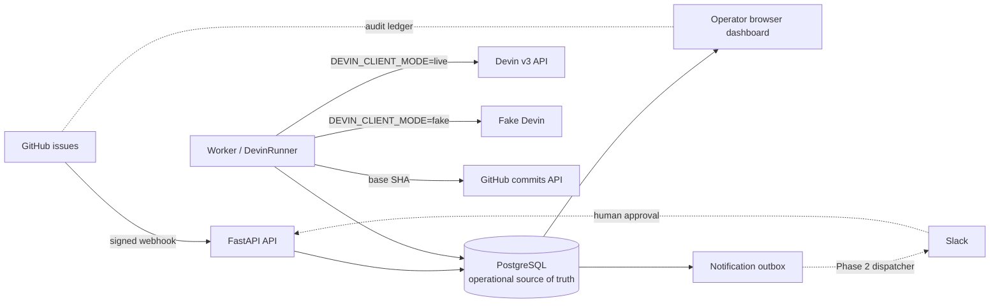
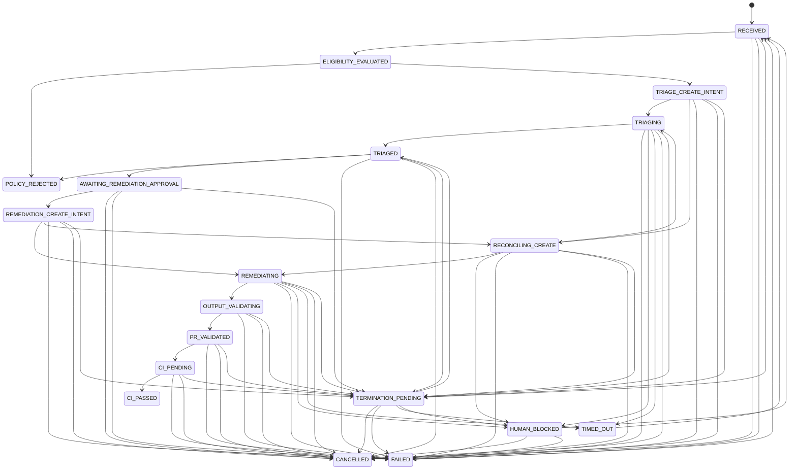

# Architecture

## Components

- **API:** FastAPI verifies signed GitHub issue deliveries, applies repository,
  event, action, and label filters, persists accepted payloads, and serves the
  authenticated operator UI.
- **Worker:** Claims pending deliveries and resumable case intents with
  PostgreSQL row locks, evaluates the zero-ACU deterministic eligibility
  filter, coordinates fake Devin sessions, and records every lifecycle change.
- **PostgreSQL:** The operational source of truth for webhook payloads, cases,
  attempts, append-only transitions, and notification outbox intents.
- **Dashboard:** Jinja2 and HTMX pages for state counts, throughput, active
  work, case history, and operator retry/cancel/approval actions.
- **Devin client (`remediator/devin`):** One `DevinClient` protocol with two
  implementations selected by `DEVIN_CLIENT_MODE`. `LiveDevinClient` calls the
  official Devin v3 API (`POST/GET/DELETE /v3/organizations/{org_id}/sessions…`)
  over httpx; `FakeDevinClient` emits API-shaped snapshots (same `status` /
  `status_detail` vocabulary) per deterministic scenario and never touches the
  network. Both share `status.classify`, the Draft 7 triage output schema, the
  versioned prompt template, and the tag helpers.
- **DevinRunner (`remediator/worker/devin_runner.py`):** The bounded session
  state machine: durable create intent → single create → reconcile-by-tag →
  poll until deadline → final GET → remote termination → schema validation.



GitHub remains the audit ledger for issue history and eventual comments or
pull requests. PostgreSQL is the operational source of truth for work state.

## Phase 2 triage flow

```text
GitHub issue opened
→ deterministic zero-ACU eligibility filter        (rubric.py, no Devin call)
→ eligible issue automatically queues Devin triage (TRIAGE_CREATE_INTENT)
→ durable create intent                            (attempts row + unique operation_key, committed BEFORE POST)
→ bounded Devin session                            (max_acu_limit, absolute timeout_at, exact op tag)
→ schema-validated triage result                   (structured_output_required + Draft 7 validation)
→ awaiting remediation approval                    (AWAITING_REMEDIATION_APPROVAL)
```

### Create intent and spend-boundary idempotency

The Devin create endpoint has no idempotency key, so the runner makes the
boundary durable on our side:

1. Insert the `attempts` row with `operation_key = op:<case>:<kind>:<n>`
   (`UNIQUE`) and `create_state = PENDING`; a partial unique index also
   enforces one unfinished attempt per `(case, kind)`. Commit.
2. Validate the request (allowlisted repository, resolvable base SHA, prompt
   renders). Any failure → `create_state = NOT_SENT`, attempt `FAILED`, no HTTP.
3. `POST /sessions` exactly once with the operation key as the first tag plus
   correlation tags (`repo:`, `issue:`, `kind:`, `case:`, `attempt:`).
   - Definitive 4xx/5xx → `API_ERROR`, attempt `FAILED`, case `FAILED`.
   - Transport failure/timeout → `UNCERTAIN`, case `RECONCILING_CREATE`.
4. Reconcile by listing sessions and matching the exact operation tag
   client-side (bounded lookups with backoff). Exactly one match →
   `RECONCILED` and polling continues on that session. No match after the
   bounded lookups, or more than one → `UNRESOLVED`, case `HUMAN_BLOCKED`.
   A second POST is never issued automatically.

### Polling and status mapping (`remediator/devin/status.py`)

| Remote `status` | `status_detail` | Disposition |
| --- | --- | --- |
| `new`, `claimed`, `running`, `resuming` | working / other | keep polling |
| any live status | `finished` | validate structured output |
| any live status | `waiting_for_user`, `waiting_for_approval` | `HUMAN_BLOCKED`, session URL retained, no replacement |
| `exit` | `finished` | validate structured output |
| `exit`, `error` | anything else | attempt `FAILED` |
| `suspended` | usage/credit/quota/billing/limit | attempt `FAILED` (terminal) |
| `suspended` | other (inactivity, user request) | `HUMAN_BLOCKED` |
| unknown | unknown | attempt `RECONCILING`, keep polling until deadline |

Session completion alone is never success: the `structured_output` must exist
and validate against `TRIAGE_OUTPUT_SCHEMA`, and `outcome` must be one of
`remediation_candidate`, `needs_human`, `no_change_needed`,
`deterministic_automation`, `invalid_issue`. Only `remediation_candidate`
advances to `AWAITING_REMEDIATION_APPROVAL`; every other outcome ends at
`POLICY_REJECTED` with a `triage_not_feasible` GitHub outbox intent carrying
the summary and blocking questions.

### Timeout and termination

When `now >= attempt.timeout_at` the runner performs one final `GET`. If the
session finished in the polling gap it is processed normally (no false
timeout). Otherwise it calls `DELETE /sessions/{id}`. Success → attempt and
case `TIMED_OUT`. Failure → case `TERMINATION_PENDING`; the worker reclaims it
after lease expiry and retries the final-GET/DELETE cycle until termination is
confirmed. Local polling therefore never stops while a paid session may still
be running unobserved.

### Restart recovery

All runner state lives in the `attempts` row (session id, deadline, poll
counters, create state). The worker claims cases in `TRIAGE_CREATE_INTENT`,
`TRIAGING`, `RECONCILING_CREATE`, and `TERMINATION_PENDING` whose lease has
expired and resumes from the persisted attempt: a `PENDING` create is
reconciled by tag rather than re-sent, a `CREATED` session is polled, a
pending termination is retried.

## Lifecycle

The eligibility filter runs without ACU cost. Eligible cases go directly to
triage; there is no approval or notification before triage. A feasible triage
verdict creates one Slack approval outbox intent. The Phase 2 Slack outbox
worker dispatches it, and a human approves or rejects from Slack. Phase 1
provides operator endpoints as the stand-in; both paths call the same approval
service.



`TRIAGE_CREATE_INTENT` and `REMEDIATION_CREATE_INTENT` make external session
creation resumable. Triage infeasibility transitions to `POLICY_REJECTED`,
records a GitHub notification intent, and creates no remediation attempt.
Retries from `FAILED` or `TIMED_OUT` normally return to eligibility, while a
case whose latest attempt is a failed remediation after successful triage
returns directly to `REMEDIATION_CREATE_INTENT`.

## Data model

| Table | Key columns | Purpose |
| --- | --- | --- |
| `webhook_events` | delivery id, payload, status, case id | Verbatim accepted webhook deliveries and processing lease |
| `cases` | issue identity, state, recommendation, Devin/PR fields | Current operational case record |
| `attempts` | case, kind, `operation_key` (unique), `create_state`, Devin session id/url/tags/status/detail, ACU telemetry, `base_sha`, `prompt_version`, poll timestamps, `timeout_at`, validated `structured_output`, `reconciliation_reason` | Durable create intent and bounded session audit; partial unique index = one unfinished attempt per (case, kind) |
| `state_transitions` | case, from/to state, reason, actor | Append-only lifecycle audit |
| `notification_outbox` | case, channel, kind, payload, status | Notification intents; not dispatched in Phase 1 |

## Webhook request path

1. Read the raw request body.
2. Verify `X-Hub-Signature-256` with HMAC-SHA256 before parsing JSON.
3. Require the delivery and event headers, parse JSON, and apply repository,
   event, action, and required-label filters.
4. Persist accepted payloads as `PENDING` using the unique delivery id.
5. Return `202`; duplicate deliveries are acknowledged as deduplicated.

Filtered requests are acknowledged but never persisted, and the API performs no
worker processing inline.

## Worker claiming and failure isolation

The worker first claims one `PENDING` webhook event, or reclaims a
`PROCESSING` event whose lease expired. It then claims cases in
`RECEIVED`, `TRIAGE_CREATE_INTENT`, `REMEDIATION_CREATE_INTENT`, or
`TERMINATION_PENDING` when their case lease is free or expired and no related
event is pending (or processing with an unexpired lease). Each claim uses
`SELECT ... FOR UPDATE SKIP LOCKED`, records a worker id and lease, and
commits before processing. This provides queue-like concurrency without
introducing Redis or another queue service.

State writes are guarded by `UPDATE ... WHERE state = expected_state` and the
current worker owner; a concurrent operator or worker therefore cannot
overwrite a newer state or a stolen lease. A heartbeat renews each case and
event lease at roughly one third of the lease duration.
Devin
CREATE_INTENT attempts have durable idempotency keys and are reconciled after
a crash, with a bounded second lookup before declaring reconciliation failure.
If a create returns after ownership was lost, the session is terminated and
the attempt is recorded as orphaned. A lease is released after success,
failure, or a concurrent-change abandonment. If a process stops, in-flight
jobs are drained for up to the configured shutdown timeout; anything longer is
reclaimed after lease expiry. Docker's worker stop grace period exceeds that
timeout.

Webhook and case processing are isolated in their own transactions. Exceptions
mark the event or case failed and are logged; the loop continues to process
other work. Invalid concurrent transitions are logged at INFO and do not fail
the case. On SIGTERM or SIGINT, loops stop after their current job, in-flight
tasks are drained up to the configured timeout, then cancelled if necessary;
the Devin client closes and the database engine is disposed.

## Security boundaries

- Signature verification occurs before JSON parsing.
- HMAC signatures and operator tokens use constant-time comparisons.
- Operator pages require a bearer token or signed-in cookie; API-like requests
  receive `401`, while browser pages redirect to `/login`.
- Secrets are environment values and are not committed to the repository.
  `DEVIN_API_KEY` is a `SecretStr`: it is excluded from `repr`, redacted from
  API error messages and log records, and never written to the database.
- Live mode fails closed: missing key/org, non-HTTPS base URL, poll interval
  below 10 s, or `SIMULATION_AUTO_APPROVE_REMEDIATION=true` refuse to start.
- Issue title/body/labels are untrusted data inside the Devin prompt, fenced
  by a per-attempt nonce delimiter; the prompt instructs Devin to ignore any
  instructions inside the fence. See [threat-model.md](threat-model.md).
- Outbox rows are recorded but not dispatched in Phase 2.
- Accepted webhook payloads are stored verbatim; deployments should consider
  retention and possible personal information in issue bodies.

## Deferred to Phase 3

- **Remediation sessions:** live mode refuses `REMEDIATION` attempts; the fake
  remediation path remains only so the Phase 1 simulation still runs.
- **GitHub App writes:** publish comments, branches, pull requests, and statuses.
- **Slack dispatcher:** dispatch pending outbox rows and retry delivery.
- **Slack approval interactivity:** call the existing approval service from Slack.
- **Stage deadline reconciliation:** apply longer-lived stage deadlines and operational escalation to `TIMED_OUT`.
- **CI webhook ingestion:** advance `CI_PENDING` from GitHub CI events.
- **Retention and cleanup:** expire old payloads, attempts, and notification records.
